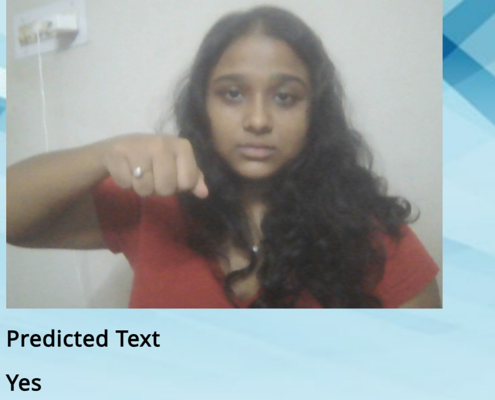
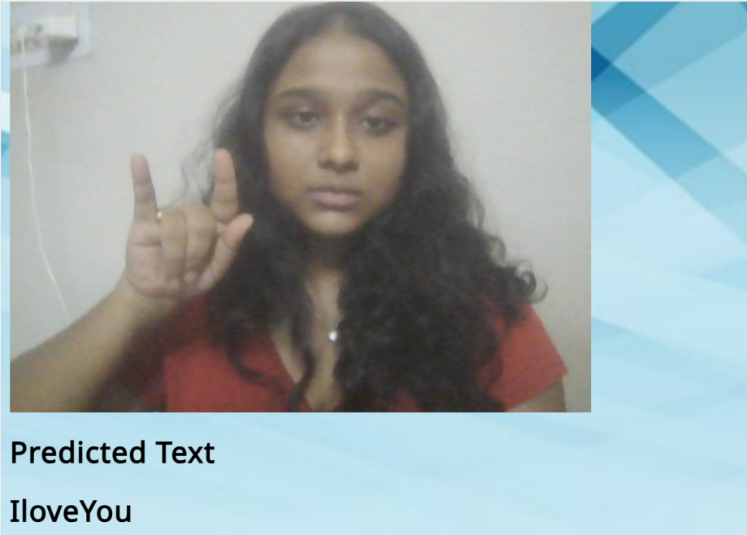

# 🧠 Gestura: The Sign Language Translator

A real-time **Indian Sign Language (ISL) gesture detection system** built using **YOLOv11**, **OpenCV**, **MediaPipe**, and **Flask**.

This project captures hand signs through a webcam and classifies them into **6 ISL gestures**, enabling fast and accessible gesture-to-text translation.

---

## 🚀 Features

* 🔍 **Real-time gesture detection** using YOLOv11
* 🎥 **Live webcam inference**
* 🖐 **Hand landmark detection** with MediaPipe
* 🧾 **Custom dataset + training pipeline**
* ⚡ **Fast inference** (CPU/GPU-supported)
* 💾 **MongoDB integration**
* 👤 **Signup / Login system**
* 🔐 **Forgot Password with OTP**
* ✉️ **OTP sending via email**
* 🔤 **Displays predicted gesture on screen**

---

## 📁 Project Structure

```
sign-language-translator/
│
├── app.py                     # Flask backend (Auth + DB + Video API)
├── SignCam.py                 # Real-time sign detection
├── body.py                    # Data collection + preprocessing
├── requirements.txt           # Dependencies
├── signLang/
│   ├── weights/
│   │     └── best1.pt         # Trained YOLOv11 model
│   └── data.yaml              # Dataset configuration + classes
├── dataset/
│   ├── train/
│   ├── val/
│   └── test/
└── README.md
```

---

## 📦 Installation

### 1️⃣ Clone the Repository

```bash
git clone https://github.com/sonalikaaaaa/sign-language-translator.git
cd sign-language-translator
```

### 2️⃣ Install Dependencies

```bash
pip install -r requirements.txt
```

---

## 🏋️‍♀️ Training the YOLOv11 Model

### **Prepare Dataset**

Place your dataset here:

```
signLang/dataset/
```

Ensure `data.yaml` exists here:

```
signLang/data.yaml
```

### **Train the Model**

```bash
yolo train model=yolo11n.pt data=signLang/data.yaml epochs=50 imgsz=640 project=runs/train name=sign_lang
```

---

## 📊 Evaluation & Curves

### 📈 Confusion Matrix

```python
from IPython.display import Image
Image("/content/runs/detect/train/confusion_matrix.png", width=600)
```

### 📉 Precision Curve (PR Curve)

```python
from IPython.display import Image
Image("/content/runs/detect/train/PR_curve.png", width=600)
```

---

## 🎥 Running Real-Time Detection

### Run Webcam Script

```bash
python SignCam.py
```

### Run Data Collection Script

```bash
python body.py
```

---

## 🧪 Model Used

* **YOLOv11 (Ultralytics)**
* Custom-trained on a **6-class Indian Sign Language gesture dataset**:
  **Hello, IloveYou, No, Please, Thanks, Yes**

---





---

## 🙌 Team

* **Pragati Das (22053085)**
* **Sonalika Padhi (22053115)**
* **Aiswarya Mohanty (22054342)**
* **Pawani (22053609)**
* **Tilottama Kedar (2205867)**

---

## ⭐ Contribute

Feel free to submit issues or pull requests!

---